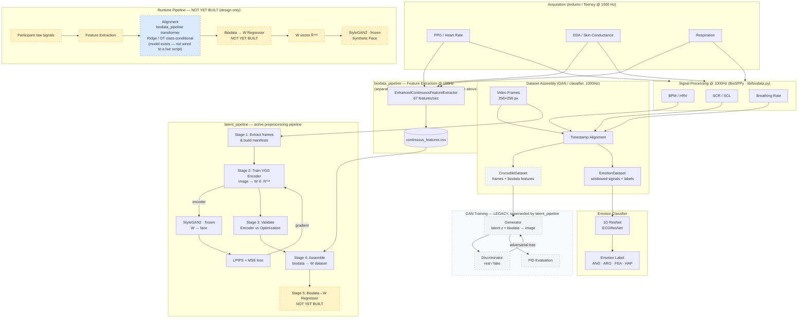
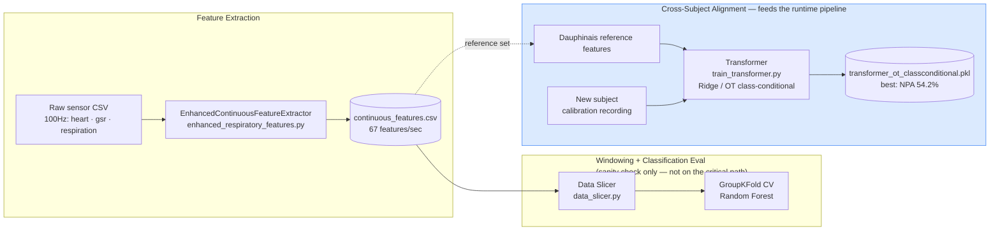
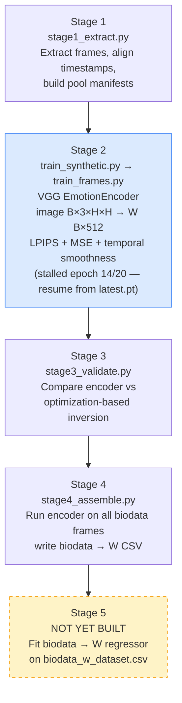

# Crocodile — Pipeline Diagram

See [PIPELINE.md](PIPELINE.md) for the prose version of this — roles, current
status, terminology. This file is the visual companion; keep them in sync.

**Legend**: grey dashed = legacy/superseded, not on the active path · amber
dashed = designed but not yet built · blue = current active-work highlight.

## Full System Overview

---

## Biodata Pipeline (standalone detail)

Two distinct roles: feed `latent_pipeline` Stage 4 (feature extraction), and
supply the runtime pipeline's alignment step (cross-subject transformer).

---

## Latent Pipeline — Stage Detail

