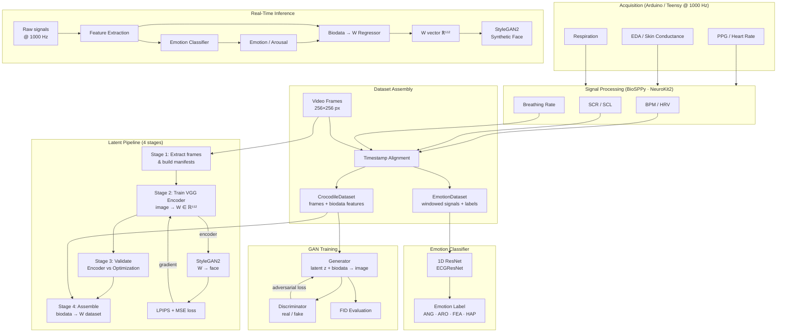
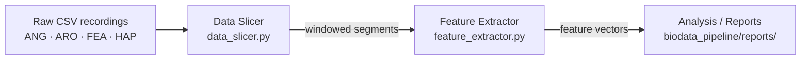
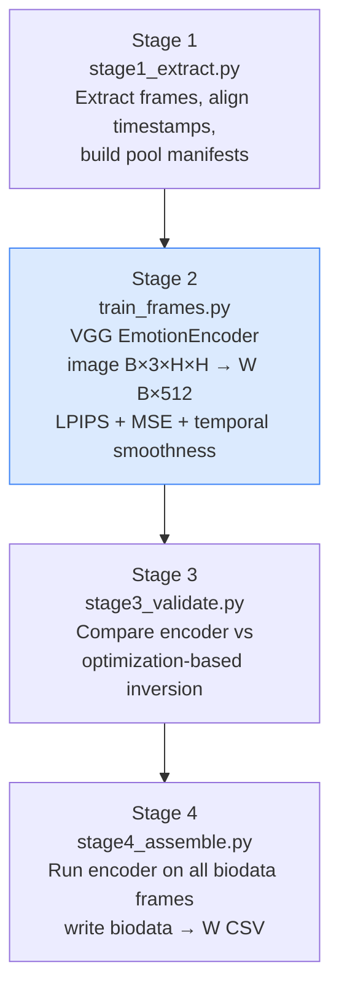

# Crocodile — Pipeline Diagram

## Full System Overview

```mermaid
flowchart TB
    subgraph SENSORS["Acquisition (Arduino / Teensy @ 1000 Hz)"]
        S1[PPG / Heart Rate]
        S2[EDA / Skin Conductance]
        S3[Respiration]
    end

    subgraph SIGNAL["Signal Processing (BioSPPy · NeuroKit2)"]
        P1[BPM / HRV]
        P2[SCR / SCL]
        P3[Breathing Rate]
    end

    subgraph DATA["Dataset Assembly"]
        V[Video Frames\n256×256 px]
        TS[Timestamp Alignment]
        CD[CrocodileDataset\nframes + biodata features]
        ED[EmotionDataset\nwindowed signals + labels]
    end

    subgraph TRAIN_GAN["GAN Training"]
        G[Generator\nlatent z + biodata → image]
        D[Discriminator\nreal / fake]
        FID[FID Evaluation]
    end

    subgraph TRAIN_ENC["Latent Pipeline (4 stages)"]
        E1[Stage 1: Extract frames\n& build manifests]
        E2[Stage 2: Train VGG Encoder\nimage → W ∈ ℝ⁵¹²]
        E3[Stage 3: Validate\nEncoder vs Optimization]
        E4[Stage 4: Assemble\nbiodata → W dataset]
        SG[StyleGAN2\nW → face]
        LPIPS[LPIPS + MSE loss]
    end

    subgraph TRAIN_CLS["Emotion Classifier"]
        CLS[1D ResNet\nECGResNet]
        EMO[Emotion Label\nANG · ARO · FEA · HAP]
    end

    subgraph INFER["Real-Time Inference"]
        RF[Raw signals\n@ 1000 Hz]
        FT[Feature Extraction]
        EC[Emotion Classifier]
        EL[Emotion / Arousal]
        REG[Biodata → W Regressor]
        WV[W vector ℝ⁵¹²]
        FACE[StyleGAN2\nSynthetic Face]
    end

    %% Acquisition → Processing
    S1 & S2 & S3 --> SIGNAL
    P1 & P2 & P3 --> TS
    V --> TS
    TS --> CD
    TS --> ED

    %% GAN training
    CD --> G
    G --> D
    D -->|adversarial loss| G
    G --> FID

    %% Latent pipeline
    V --> E1
    E1 --> E2
    E2 -->|encoder| SG
    SG --> LPIPS
    LPIPS -->|gradient| E2
    E2 --> E3
    E3 --> E4
    CD --> E4

    %% Classifier training
    ED --> CLS
    CLS --> EMO

    %% Inference chain
    RF --> FT
    FT --> EC
    EC --> EL
    FT --> REG
    EL --> REG
    REG --> WV
    WV --> FACE
```

---

## Biodata Pipeline (modular, standalone)

```mermaid
flowchart LR
    RAW[Raw CSV recordings\nANG · ARO · FEA · HAP]
    DS[Data Slicer\ndata_slicer.py]
    FE[Feature Extractor\nfeature_extractor.py]
    AN[Analysis / Reports\nbiodata_pipeline/reports/]

    RAW --> DS
    DS -->|windowed segments| FE
    FE -->|feature vectors| AN
```

---

## Latent Pipeline — Stage Detail

```mermaid
flowchart TD
    S1["Stage 1\nstage1_extract.py\nExtract frames, align timestamps,\nbuild pool manifests"]
    S2["Stage 2\ntrain_frames.py\nVGG EmotionEncoder\nimage B×3×H×H → W B×512\nLPIPS + MSE + temporal smoothness"]
    S3["Stage 3\nstage3_validate.py\nCompare encoder vs\noptimization-based inversion"]
    S4["Stage 4\nstage4_assemble.py\nRun encoder on all biodata frames\nwrite biodata → W CSV"]

    S1 --> S2 --> S3 --> S4

    style S2 fill:#dbeafe,stroke:#3b82f6
```
